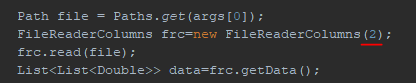
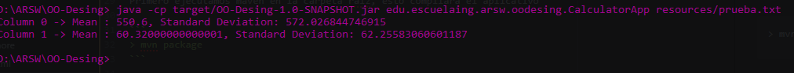
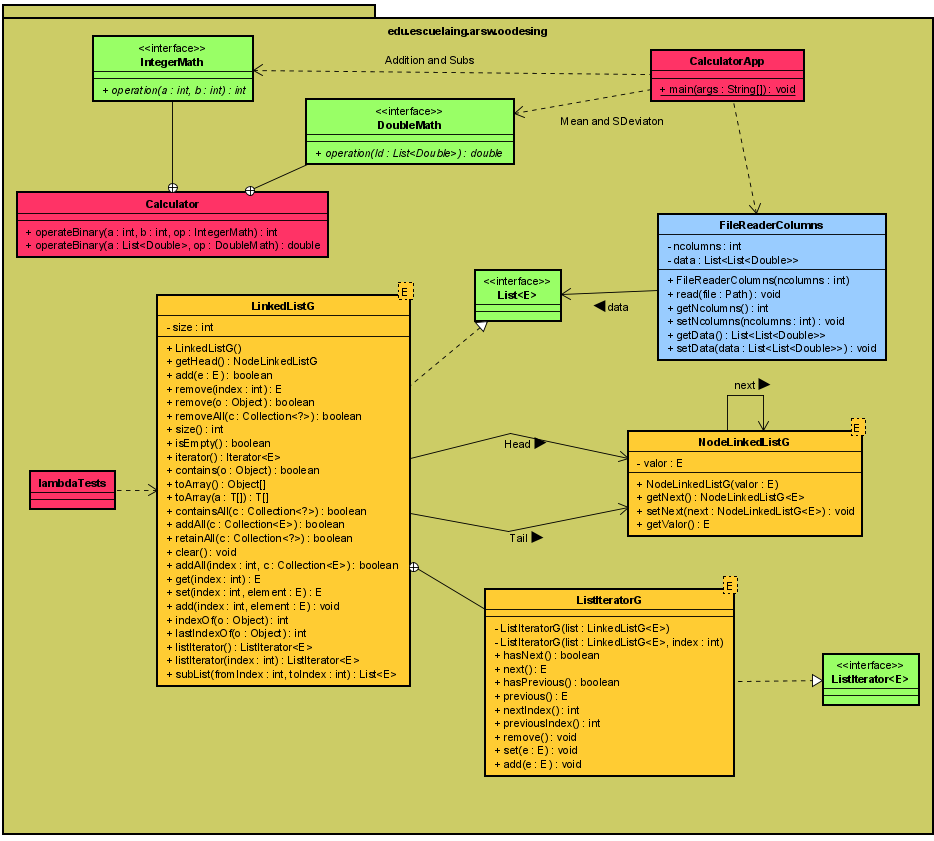
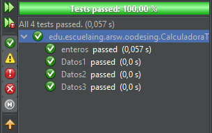
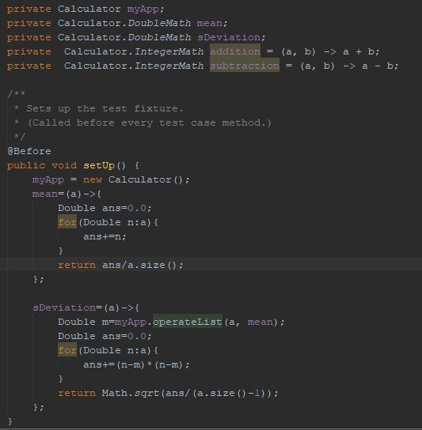
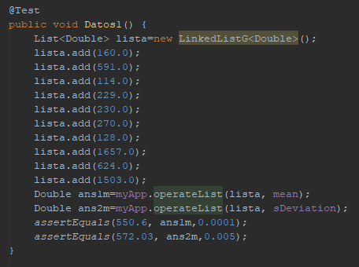
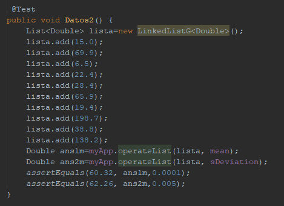
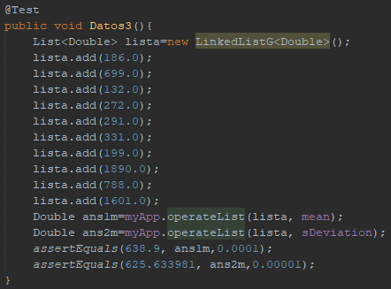
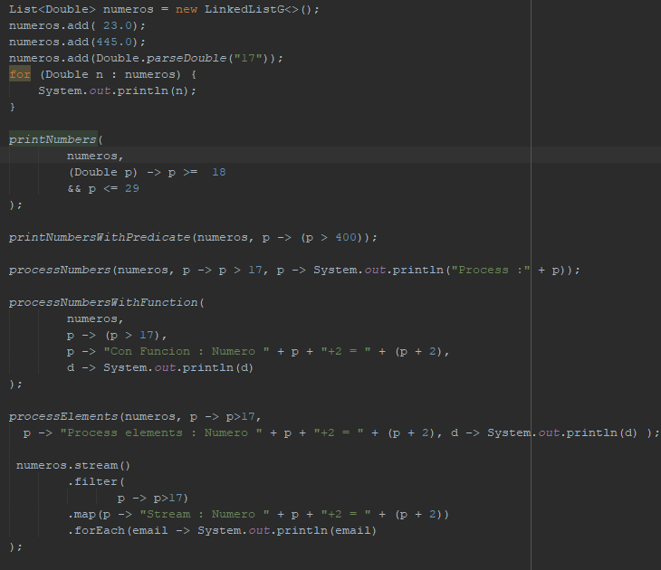

# OO Desing

Esta aplicación permite calcular la media y la desviacion estandar de conjunto de datos puestos como columnas.

## Autor

* **J. Eduardo Arias Barrera** - *Initial work* - [AriasAEnima](https://github.com/AriasAEnima)


## Rendimiento LOC/h

1. Desde las 11:00 , hasta las 22:00 (con un receso de 2 hr)  fueron aprox 250 lineas
2. Desde las 18:00 , hasta las 20:00 PM fueron aprox 50 lineas.

LOC=23 LOC/h

### Prerrequisitos

Java JDK 1.8, Maven y Git.

* [JAVA JDK 8](http://www.oracle.com/technetwork/java/javase/overview/index.html) - Version de Java
* [Maven](https://maven.apache.org/) - Maven
* [JUnit 3.8.1](https://mvnrepository.com/artifact/junit/junit/3.8.1) - Para Pruebas

## Para empezar

Se debe ejecutar en la carpeta que queremos que esté
```
> git clone https://github.com/AriasAEnima/OO-Desing.git
```
### Instalación

Primero ejecutamos maven en la carpeta raiz, esto compilara el aplicativo

```
> mvn package
```

## Ejecucion:

Para correr por terminal debemos tener un archivo con los datos, actualmente leerá dos columnas, este valor puede ser cambiado en archivo CalculatorApp.java :


Y utilizaremos este comando:
```
> java -cp target/OO-Desing-1.0-SNAPSHOT.jar edu.escuelaing.arsw.oodesing.CalculatorApp <path-archivo>

```

Y nos debera arrojar algo similar:



## Diseño Utilizado



Podríamos decir que un acercamiento a un patron de comando en el cual la interfaces definidas como DoubleMath/IntegerMath serian una Interfaz <Comando> (cada una) y los creados por medio de lambda como classes anónimas: adicción, sustracción, media y desviación estándar serian <Comandos Concretos>, y el <execute()> como "operation(...)"; como dije es un acercamiento ya que utilizamos interfaces funcionales para emplear contenedores genéricos.

También se utilizo el patron Iterador en la implementación de LinkedListG (nótese la diferencia en la G) usando una implementación propia de Nodos e Iteradores de Lista. (Iterator es superinterfaz de ListIterator).

Estas dos implementaciones nos permite agregar funciones fácilmente y ejecutarlas utilizando contenedores que permiten utilizar cualquier tipo de objeto , y que el compilador nos ayudara a garantizar que estos será de un mismo tipo.

### Pruebas especificas
Se corrieron 3 , probando que se puedan agregar funciones de forma genérica y que el calculo de estas fuera correcto y una cuarta para confirmar que lo que había de ejemplo en la calculadora estaba correcto.



Las pruebas utilizaron esta configuración de inicial:



Agregamos la funcion mean y sDeviation.

Aqui la muestra de las pruebas adicionadas:

Prueba 1 | Prueba 2 |
---------|----------|
 | 
Prueba3 |
 |

Comparamos la media y desviación calculada con la esperada de ejemplos, la precision vario entre una prueba y otra dado al redondeo del esperado.

Tambien hay un archivo donde deje unas pruebas de utilización genérica y lambda, llamado lambdaTests.java


## Documentación:

Se encuentra en la carpeta
```
> cd src/site/
```

## Bibliografía

Iterator. (2020, 5 abril). Recuperado 5 de junio de 2020, de https://refactoring.guru/design-patterns/iterator

Command. (2020, 5 abril). Recuperado 5 de junio de 2020, de https://refactoring.guru/design-patterns/command
## Licencia

This project is licensed under the GNU General Public License - see the [LICENSE](LICENSE) file for details
